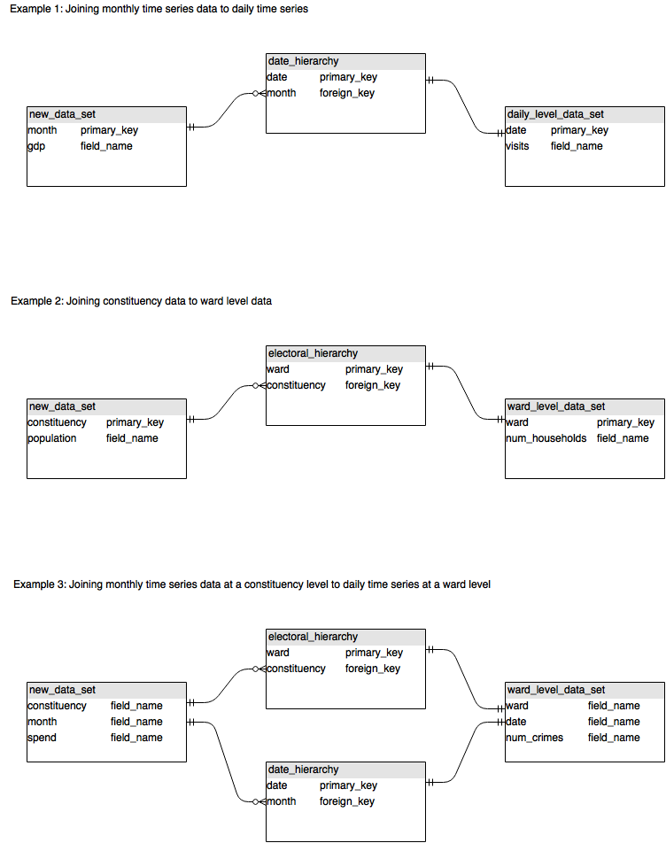

# geouk

We created this repository while working on project analysing food bank data provided by the Trussell Trust. We (The University of Hull, Coppelia and AAM associates) found we needed some common standards in order to collaborate when working with the hundreds of open geospatial data sets that are available online.

Once we had an agreement on what the data should look like it was much easier to put together some tools that provide standard views on it (maps, time series plots etc). These tools include

1. geoukr, an r package for produce maps and time series plots of the data
2. Javascript code to create a browser based tool that allows the user to explore maps of the data
3. The SQL to create a mySQL database from the csv files
4. python code for downloading various open source data sets

Unless they are hard to find we haven't provided the open data sets themselves (that would just duplicate what already exists) but rather 

1. Code that downloads the datasets
2. Useful transformations of the datasets (or the code to make those transformations if the data sets are too large to add to the repository.
3. The tables that we used to link them together. 

## Conventions for our data

1. All tables and column names use `lower_case_with_underscores`
2. All file names use `mixedCase`
3. When stored in flat files
  1. Full dates are formatted as `dd-mm-yyyy`
  2. Month year as `jan-2015`
  3. Week year as `01-2015`
4. Week numbering starts on the first week that has 4 or more days inside the current year

## Not essential but preferred

1. Count measures start with `num_`
2. Percentage measures start with `pct_`

## Process for adding new data

* Data needs to join other data sets by date or by geographical location. Any new data set therefore must have a column that contains values that are to be found in one of the columns of the `date_hierarchy` table or one of the columsn of any of the `geo_hierarchy` tables or both.
* Only import columns that have an obvious use (to avoid being swamped by data) and avoid duplicating information
* Include the source of the data in the metadata 

## Types of table

1. Hierarchy tables (includes the `date_hierarchy` table which maps date to useful longer time periods and the `geo_hierarchy` tables which include 
  1. `postal_geo_hierarchy`
  2. `electoral_geo_hierarchy`
  3. `admin_geo_hierarchy`
2. Bridge tables
3. Metadata tables

